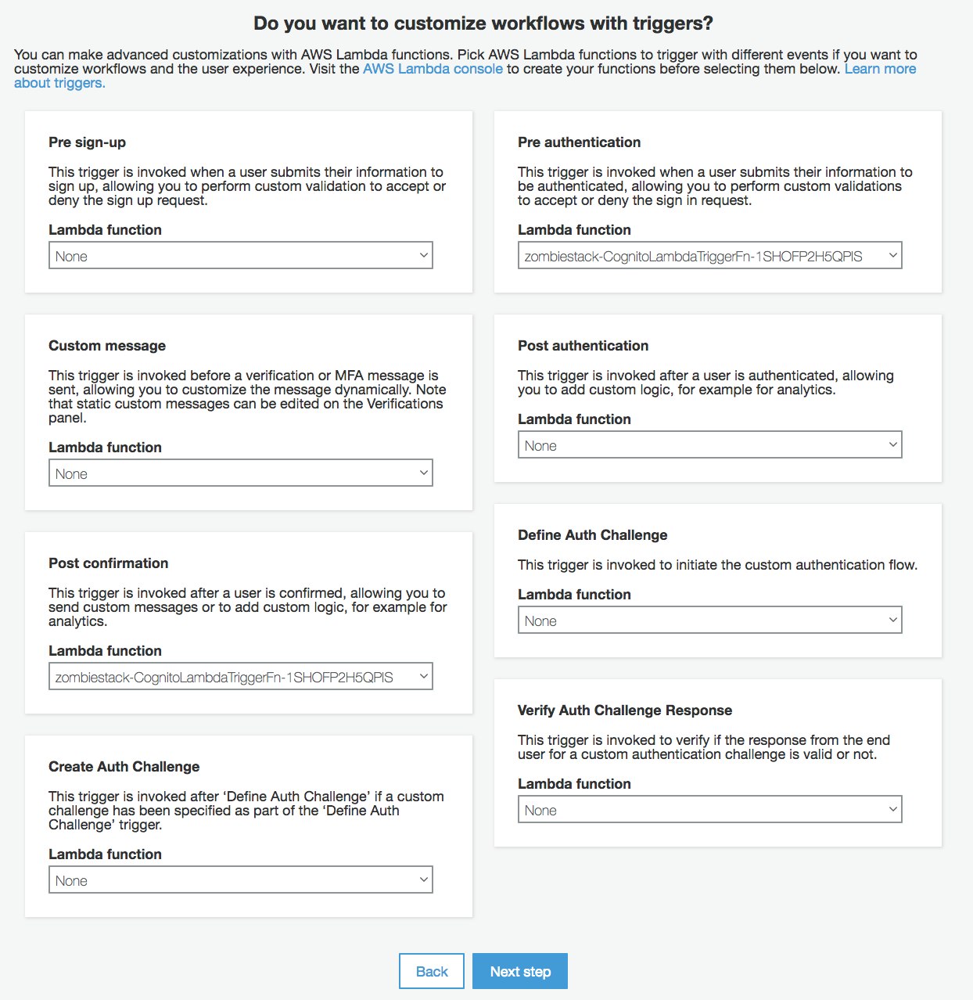

# Lab 1: Authentication with Cognito User Pools

In this lab, you will integrate user authentication and API authorization into your serverless survivor chat application with [Amazon Cognito](https://aws.amazon.com/cognito/). 

## Architecture Overview

The Zombie survivor chat requires a survivor to sign up for a user account in order to communicate with other survivors. Once a survivor signs up for an account, they will be able to authenticate into the communications system in order to chat with other apocalypse survivors. [Amazon Cognito](https://aws.amazon.com/cognito/) provides the ability to create user directories for your application users with [Cognito User Pools].(http://docs.aws.amazon.com/cognito/latest/developerguide/cognito-user-identity-pools.html). You will now setup a new Cognito User Pool as a user directory for your application. 

Once a survivor has successfully signed up for an account, they will be able to log into the communications system. When a user logs in, Cognito will return a JWT token (JSON Web Token) to the application which is used to fill the authentication header in web requests to your API from the application. 

In this lab you will perform the following steps - 

1. Create a user directory for your application with Cognito User Pools

2. Update the Javascript application to integrate with User Pools

3. Setup a Cognito User Pools Authorizer in API Gateway, configure your API methods to require Authorization

  

## Lab Instructions

> Note: Before starting this lab, please make sure you have already [launched the CloudFormation template](../README.md##Get-Started) and the status of the stack is CREATE_COMPLETE.

### 1. Create the Cognito User Pool

You will use the AWS Management Console to create a User Pool for your application.

<strong>Step-by-step instructions (expand for details)</strong>

1. In the AWS Management Console, in the AWS Services search bar, type `cognito` and then select **Cognito** from the drop down.

2. Choose **Manage your User Pools**

3. In the Cognito User Pools console, select the blue **Create a User Pool** button in the upper right corner. 

4. In the Pool Name text box, name your user pool `[YOUR CLOUDFORMATION STACK NAME]-userpool`. For example, if you left your CloudFormation stack as the default name of "zombiestack" earlier, then your user pool name would be "zombiestack-userpool". After naming your User Pool, click **Step through Settings** to continue with manual setup.

   

5. On the attributes page, select the **Required** checkbox for the following attributes: `email, name, phone number`. Make sure that these are the only attributes you select. The application for the this workshop is designed to only work with the above three attributes at this time. Make sure not to select additional options. 

> Note: Cognito User Pools allows you to define attributes that you'd like to associate with users of your application. These represent values that your users will provide when they sign up for your app. They are available to your application as a part of the session data provided to your client apps when users authenticate with Cognito. 

6. Click the link **Add custom attribute**. Type a **Name** of `slackuser` exactly as typed here and leave the rest of the fields as is. Then click **Add another attribute** and add another custom attribute named `slackteamdomain`, leaving the rest of the fields as is. Finally, add a 3rd custom attribute by clicking **Add another attribute** and type `camp` as the name, leaving the rest of the fields as is. Click **Next Step**.

  

7. On the next page, leave the Password policy settings as default and click **Next step**.

8. On the verifications page, leave the defaults and click **Next step**.

> Note: We will not require MFA for this application, or SMS. However, during our application's sign up process, we are requiring verification via email address. This is denoted with the email checkbox selected for "Do you want to require verification of emails or phone numbers?". With this setting, when users sign up for the application, a confirmation code will be sent to their email which they'll be required to input into the application for confirmation before their account creation is completed.

9. On the next page, type `Signal Corps Survivor Confirmation` for the **Email subject**. We won't modify the message body but you could add your own custom message in there. We'll let Cognito send the confirmation code emails from the service email address, but in production you could configure Cognito to send these verifications from an SES verified address along with a custom message. Leave the rest of the default settings and click **Next step**.

10. On the Tags page, leave the defaults and click **Next step**. 

11. Next, on the Devices page, leave the default option of **No** selected and click **Next step**. 

12. On the Apps page, click **Add an app client**. In the **App client name** textbox, type `Zombie Survivor Chat App`. Then make sure to **deselect** all of the options checkboxes. We aren't generated a client secret. Click **Set attribute read and write permissions** to expand it. 

13. For both the **Readable Attributes** and **Writeable Attributes** settings, verify that **all of the checkboxes are selected**. Then click **Create app client**, and then click **Next step**.

14. On the custom triggers page, you will configure a `Pre authentication` trigger and a `Post confirmation` trigger. In the dropdowns for the **Pre authentication** and **Post confirmation** triggers, select the Lambda function named `[YOUR CLOUDFORMATION STACK NAME]-CognitoLambdaTriggerFn-...`. Click **Next step**.

  

15. Review the settings for your User Pool and click **Create pool**. If your pool created successfully you should be returned to the User Pool Details web page and it will display a green box that says **Your user pool was created successfully**.

  

16. Open a text editor on your computer and copy your `Pool Id` from the User Pool into the text editor. It should be displayed at the top of the page. Then click into the **App clients** tab found on the left side navigation pane of the Cognito console under General Settings. You should see an **App client id** displayed on the page. Copy the `App client id` into your text editor as well.

You have now created a User Pool for your application users and you should have the `Pool Id` and `App client id` in your text editor. Proceed to the next step of this lab to update your application code to work with this User Pool.

### 2. Update the static website constants.js config file

The zombie chat application uses a [constants.js](../app/assets/js/constants.js) file to bootstrap the application with variables in order to work properly. This file will be updated by CloudFormation as a part of the deployment process with new bootstrap variables. In this step, you will download that file from your S3 bucket, update the file, and re-upload it to your S3 bucket with the rest of the configuration variables needed to make the application work.

<strong>Step-by-step instructions (expand for details)</strong>

1. Return to the main landing page of the AWS Management Console. In the AWS Services search bar, type `S3` and then select **S3** from the drop down. Navigate to the S3 bucket that was created for you by when you launched the CloudFormation stack. If you don't know the name of your bucket, you can find it in the **Output** tab in the CloudFormation console listed as `Bucket`.

2. Click your bucket and navigate to the **constants.js** file found in the following folder path, `YOUR_BUCKET_NAME/app/assets/js/constants.js`. Download the file to your local machine and open it. 

> Note: YOUR_BUCKET_NAME should be replaced with your actual bucket from the CloudFormation Output tab

3. With the constants.js file open, Set the **USER_POOL_ID** variable to your `Pool Id` from your text editor. Set the **CLIENT_ID** to your `App client id` from your text editor and save the constants.js file.

4. Upload your new **constants.js** file back to the same location where you originally downloaded it from. To do this, select the blue **Upload** button in S3 console to upload a new object.

  

## Implementation Validation

After creating the User Pool and uploading a modified configuration constants file to S3, you are ready to test the application sign-up and sign-in!

1. Navigate back to the browser tab where your zombie chat application is opened. If you closed that window, you can find the S3 URL to your applicaiton in the Outputs tab of your CloudFormation stack. 

2. In our application we are not dynmically pulling down configuration changes automatically. If you already had the application open in your browser, make sure to refresh the page to ensure that the updated constants file is loaded.

3. Select the **Sign Up** link to switch views. Fill out your information to sign up for the survivor chat service as shown below.

  

4. After filling in your information, click **Sign Up** which should forward you to a confirmation screen as shown below. Head to your email inbox for the email address you used during the sign up process. You should have received a no-reply email (we didn't setup custom SMTP in this workshop) with your confirmation code from Cognito. Check your spam folder if you can't find it. Insert that code along with your email address into the confirmation screen in the application and select the **Confirm** button. If confirmed, you will be forwarded to the sign in page where you can sign into the chat with your credentials.

  

5. Once you have signed into the application, select the red **Start Chatting** button next to your name to enter the chat. This toggle allows you to manually enter and leave the chat and stop polling the API. Start typing messages in the chat and you should see your messages appearing in the chat window. Share your web application URL with your teammates so they can create accounts and chat with you!

## Completion

In this lab you successfully setup a user directory for your serverless application and integrated it with your application. In the next [Continuous Delivery Pipeline Module](../2_ContinuousDeliveryPipeline), you will learn how to automate this deployment process using AWS CodePipeline and AWS CodeBuild.
