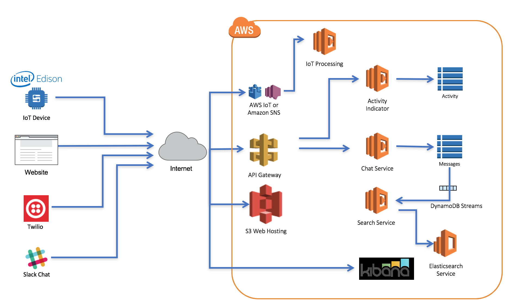
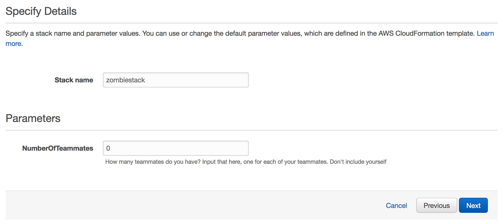

# AWS Zombie Microservices Workshop

The [AWS Zombie Microservices Workshop](http://aws.amazon.com/events/zombie-microservices-roadshow/) introduces the basics of building serverless applications using [AWS Lambda](https://aws.amazon.com/lambda/), [Amazon API Gateway](https://aws.amazon.com/api-gateway/), [Amazon DynamoDB](https://aws.amazon.com/dynamodb/), [Amazon Cognito](https://aws.amazon.com/cognito/), [Amazon SNS](https://aws.amazon.com/sns/), and other AWS services. In this workshop, as a new member of the AWS Lambda Signal Corps, you are tasked with completing the development of a serverless survivor communications system during the Zombie Apocalypse.

This workshop provides a [CloudFormation](https://aws.amazon.com/cloudformation/) template that deploys the survivor chat. You will then complete lab exercises/modules that extend the functionality of the communications system. You're also encouraged to get creative and add your own custom functionality!

The below diagram represents a high level overview of the completed workshop

## Prerequisites

### AWS Account

In order to complete this workshop you'll need an AWS Account with access to create AWS IAM, S3, DynamoDB, Lambda, API Gateway, Cognito, SNS, and Elasticsearch Service resources. 

**It is recommended to do this workshop individually with your own separate AWS Account.** This maximizes the learning experience and allows you to keep your resources for further development and customization. 

You may optionally choose to work as a team, but please keep the following in mind:

* The workshop has been designed with unique resource naming to allow for multiple CloudFormation stacks to be launched into a single AWS Account. This allows multiple users in one AWS Account to individually launch their own workshop CloudFormation template. However, there are manual resources that you will create in the labs, so make sure that you and your teammates are using unique names when manually creating new Lambda functions and other resources. Also keep this in mind if you are deleting resources.

* Alternatively, one teammate can launch the CloudFormation template and provide a CloudFormation input parameter representing the number of teammates you are working with. CloudFormation will then automatically create additional IAM Users in your AWS Account which you can share with your teammates. This is useful if you want to all work on the same instance of the workshop. In this scenario, it is common for the team to distribute the labs and each teammate will work on a different lab/module.

All of the resources you will launch as part of this workshop are eligible for the AWS free tier if your account is less than 12 months old. See the [AWS Free Tier page](https://aws.amazon.com/free/) for more details. 

### Browser

We recommend you use the latest version of Chrome or Firefox when testing the web application UI.

## Get Started - Launch the workshop!

To begin this workshop, **click one of the 'Launch Stack' buttons below for the region you'd like to use**. This is the AWS region where you will launch resources for the duration of this workshop. This will open the CloudFormation template in the AWS Management Console for the region you select.

Region | Launch Template
------------ | -------------
**N. Virginia** (us-east-1) | 
**Ohio** (us-east-2) | 
**Oregon** (us-west-2) | 
**Ireland** (eu-west-1) | 
**London** (eu-west-2) | 
**Frankfurt** (eu-central-1) | 
**Tokyo** (ap-northeast-1) | 
**Seoul** (ap-northeast-2) | 
**Singapore** (ap-southeast-1) | 
**Sydney** (ap-southeast-2) | 

<strong>CloudFormation Launch Instructions</strong>

1. Click the **Launch Stack** link above for the region of your choice.

2. Click **Next** on the Select Template page.

3. The **Stack name** has been auto-filled for you. You can customize that to a name of your choice **less than 15 characters in length** or leave as is.

4. In the **Parameters** section, if you want to develop with a team and would like to create IAM Users in your account to grant your teammates access, then specify how many teammates/users you want to be created in the **NumberOfTeammates** text box. Otherwise, leave it defaulted to 0 and no additional users will be created. The user launching the stack (you) already has the necessary permissions. Click **Next**.

    

5. On the "Options" page, leave the defaults and click **Next**.

6. On the "Review" page, verify your selections, then scroll to the bottom and select the checkbox **I acknowledge that AWS CloudFormation might create IAM resources**. Then click **Create** to launch your stack.

7. Your stack will take about 3 minutes to launch and you can track its progress in the "Events" tab. When it is done creating, the status will change to **CREATE_COMPLETE**.

8. Click the **Output** tab in CloudFormation and click the link for **MyChatRoomURL**. This should open your chat application in a new tab. Verify that your Zombie survivor chat application properly loads in the browser. Leave this tab open as you'll come back to it later.

    This CloudFormation template creates resources in your account, including an S3 bucket that will store your website static assets. A [Lambda-backed Custom resource](http://docs.aws.amazon.com/AWSCloudFormation/latest/UserGuide/template-custom-resources-lambda.html) is used to copy the static website assets from a central hosting S3 bucket into your own newly-created bucket.

9. You have successfully launched the Zombie workshop. You're ready to move onto the labs. Proceed to [Lab 1 Authentication with Cognito User Pools](1_Cognito).

## Labs/Modules

> Note: Before starting these labs, please make sure you have already launched the CloudFormation template (see above) and the status of the stack is CREATE_COMPLETE. Lab 1 (Cognito Setup) is a required lab that must be completed before proceeding to the other labs. The rest of the labs (2-6) are indepedent sections and you may choose to do some or all of them, or in any order that you prefer.

**The workshop consists of the following labs -** 

- [**1. Authentication with Cognito User Pools (Required)**](1_Cognito) - In this required lab, you will integrate user authentication and API authorization into your serverless survivor chat application with [Amazon Cognito](https://aws.amazon.com/cognito/). 

- [**2. Survivor Chat Typing Indicator**](2_TypingIndicator) - In this lab you will configure a new typing indicator service in your existing zombie REST API. You will configure the survivor chat application to display which survivors are currently typing in the chat room. This lab uses Lambda, DynamoDB, and API Gateway.

- [**3. SMS Text Message Integration with Twilio**](3_TwilioSMS) - This exercise uses [Twilio](https://twilio.com) to integrate SMS text functionality with the survivor chat application. You will configure a free-trial Twilio phone number so that users can send text messages to the survivor chat application. You'll learn how to use the mapping templates in API Gateway to perform request/response transformations in an API. This lab uses Lambda, API Gateway, DynamoDB, and Twilio.

- [**4. Message History Logging with Elasticsearch Service**](4_Elasticsearch) - In this lab you'll setup near-realtime streaming of survivor chat messages from the Chat system into Amazon Elasticsearch Service to capture message history. This lab uses Lambda, DynamoDB, and Amazon Elasticsearch Service.

- [**5. Send Messages from Slack**](5_Slack) - This exercise integrates the popular messaging app, [Slack](http://slack.com), into the chat application so that survivors can send messages to survivors from Slack. This lab uses Lambda, API Gateway, DynamoDB, and Slack.

- [**6. Zombie Motion Sensor w/ Intel Edison**](6_ZombieSensor) - This exercise integrations motion sensor detection of zombies to the chat system using an Intel Edison board and a Grove PIR Motion Sensor, which is included in the [Intel® Edison and Grove IoT Starter Kit Powered by AWS](https://www.amazon.com/gp/product/B0168KU5FK?ref%5F=sr%5F1%5F1&qid=1488908337&sr=8-1-spons&keywords=grove%20iot%20starter%20kit%20aws&psc=1&smid=A1YP59NGBNBZUR&pldnSite=1). You will configure a Lambda function to consume motion detection events incoming from your sensor and send them into the survivor chat to alert survivors! You can alternatively use your own application code to simulate motion events, use an [AWS IoT Button](https://aws.amazon.com/iotbutton/), or other IoT device to send messages into the survivor chat. This lab uses Lambda, DynamoDB, SNS, and an IoT device.
